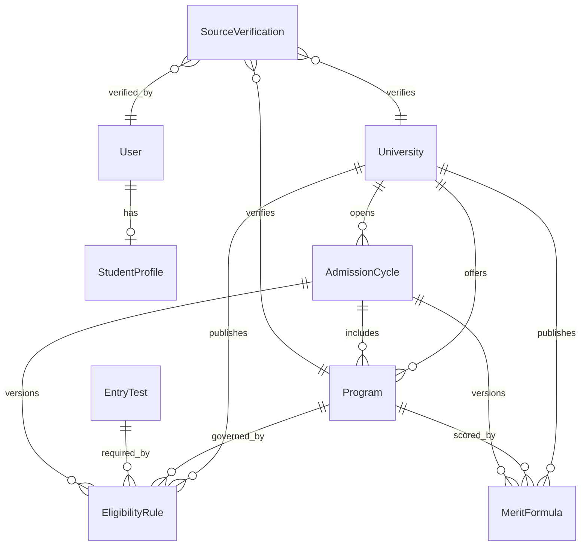

# Domain Model

This document defines the first database design for the Punjab-focused DAE2UNI Pathway application. It deliberately covers domain data only. Passwords, JWTs, login flows, authorization middleware, CRUD APIs, and calculation services are separate future milestones.

## Design Principles

1. Eligibility rules and merit formulas live in MongoDB rather than React code.
2. Every decision input is structured so the future engine can explain why a student is eligible or ineligible and how an aggregate was calculated.
3. Admission facts are time-bound through `AdmissionCycle` and effective dates.
4. Official URLs, verification state, and verification dates are first-class data.
5. Formula records contain declarative components only. They never contain JavaScript or strings that would be evaluated as code.
6. The current enums intentionally enforce the initial scope: DAE CIT students, Punjab campuses, and undergraduate programs.

## Relationships



`SourceVerification` uses a controlled polymorphic reference and can also verify eligibility rules, merit formulas, entry tests, and admission cycles.

## Model Responsibilities

| Model | Responsibility |
| --- | --- |
| `User` | Basic person identity, role, and account lifecycle. It intentionally has no password or authentication behavior yet. |
| `StudentProfile` | DAE CIT, Matric, domicile, and preference data used as inputs to eligibility and merit calculations. Drafts may be partial; completion enforces all calculation inputs. Percentages are derived from marks to prevent inconsistent values. |
| `University` | Punjab institution identity, sector, campuses, contact information, publication state, and official-source summary. |
| `Program` | A university's undergraduate offering, credential, duration, campus availability, and official-source summary. |
| `EligibilityRule` | Versionable, explainable DAE CIT acceptance criteria, generic condition groups, domicile restrictions, and entry-test requirements. |
| `MeritFormula` | Declarative weighted components, additions/deductions, rounding, minimum aggregate, and tie-breakers. Published weighted components must total 100%. |
| `EntryTest` | Reusable test definition and scoring metadata. Cycle-specific test dates belong to `AdmissionCycle`. |
| `AdmissionCycle` | Academic intake, offered programs, application windows, deadlines, and entry-test schedules for one university. |
| `SourceVerification` | Audit record showing which official source was checked, by whom, when, what evidence was found, and when it should be reviewed again. |

## Eligibility Evaluation Shape

An `EligibilityRule` is selected by university, program, admission cycle, applicant category, effective date, and publication state. A future eligibility service should:

1. Match the student's DAE technology against `qualificationCriteria`.
2. Apply the configured `any` or `all` qualification logic.
3. Check marks, passing year, board, subjects, equivalence, domicile, and structured condition groups.
4. Check each referenced entry-test requirement.
5. Return each criterion's stored explanation with its pass/fail result.

Generic conditions use a controlled operator set (`equals`, `in`, `gte`, and similar operators) and a profile field path. The future engine must allow-list supported field paths; it must not execute arbitrary database expressions.

## Merit Calculation Shape

Each `MeritFormula.components` item declares an input source and operation. For example:

```text
DAE percentage × 70% + entry-test percentage × 30%
```

would be stored as two `weighted_percentage` components with weights of `70` and `30`. Raw entry-test scores must declare their maximum input so they can be normalized. Fixed additions and deductions are explicit components, not hidden special cases.

The future calculation service should return:

- Each input value used
- Each component's contribution
- Additions, deductions, and caps
- The unrounded and rounded aggregate
- The formula and admission-cycle identifiers
- A human-readable explanation

## Source Verification Workflow

Source-backed records contain a compact `source` summary with:

- `officialUrl`
- `verificationStatus`
- `lastVerifiedAt`
- Optional `verificationRecord` reference

`SourceVerification` stores the detailed audit history. When an administrator verifies a source, the future service should create an audit record and update the parent record's source summary in one transaction. Published data should be filtered or clearly labeled when its verification state is stale or needs review.

## Important Future Service Rules

- Validate that referenced programs belong to the selected university.
- Validate that cycle-specific rules and formulas belong to the same university and cycle.
- Prevent overlapping published rules with equal priority unless explicitly supported.
- Use MongoDB transactions when publishing related rule, formula, and verification updates.
- Keep calculation snapshots with future student applications so historical results remain reproducible after rules change.
